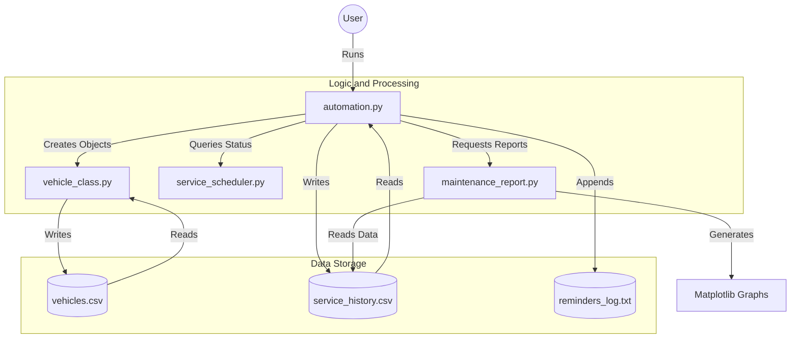
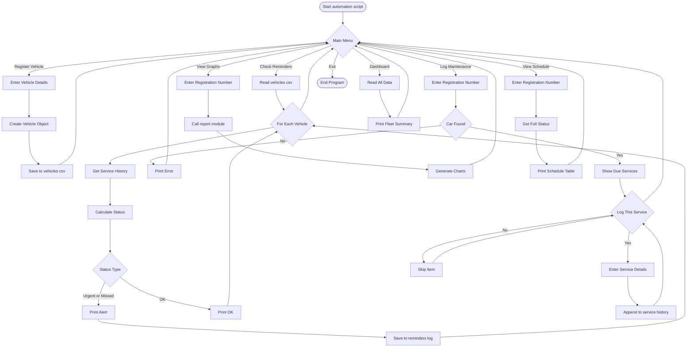
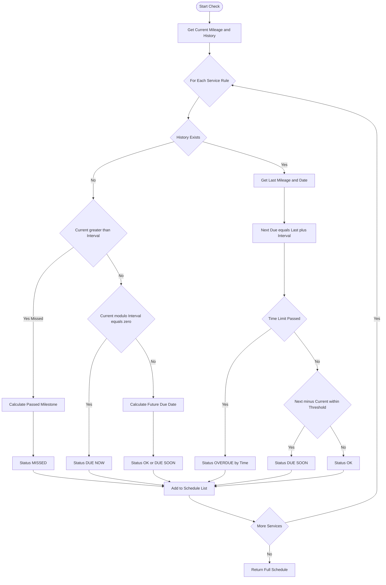
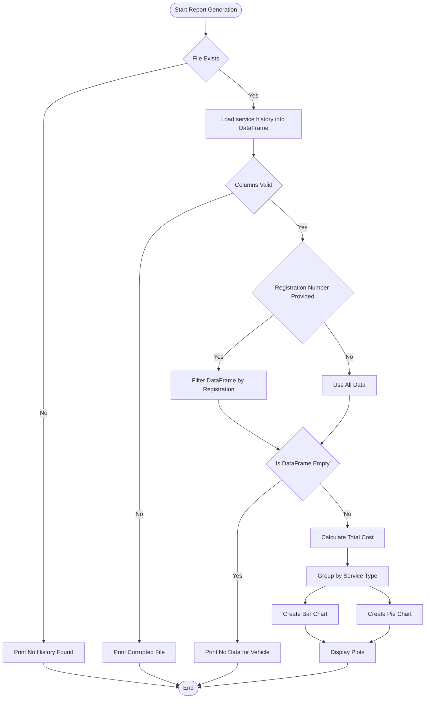

# 🚗 Vehicle Service Reminder System (v4.0)


> **An intelligent, automated Python system for tracking vehicle maintenance, predicting service schedules, and analyzing maintenance costs through a robust CLI interface.**

---

## 📖 Overview

Vehicle owners often lose track of maintenance schedules, resulting in reduced vehicle lifespan, safety risks, and unexpected expenses.  
The **Vehicle Service Reminder System** eliminates manual tracking by providing a **smart, automated Command Line Interface (CLI)**.

Unlike basic reminder tools, this system uses a **Smart Scheduler** that reasons about:
- missed mileage milestones  
- skipped service history  
- future service predictions  

It is designed to reflect **real-world usage**, not ideal data.

---

## ✨ Key Features

| Feature | Description |
|------|------------|
| 🧠 **Intelligent Scheduling** | Uses a **Triple-Check Algorithm** to classify services as `DUE NOW`, `MISSED`, or `UPCOMING`. |
| 📊 **Visual Analytics** | Generates bar and pie charts for cost breakdown and service frequency using **Matplotlib**. |
| 💾 **Persistent Storage** | All vehicle and service data is stored in CSV files and survives across sessions. |
| 🛡️ **Robust Error Handling** | Handles corrupted files, missing data, and invalid inputs gracefully. |
| 🖥️ **CLI Dashboard** | Displays fleet summary, urgent services, and recent logs in one view. |

---

## 📂 Project Structure

```
Vehicle-Service-System/
│
├── automation.py           # Controller: CLI menu & orchestration
├── vehicle_class.py        # Blueprint: Vehicle object & persistence
├── service_scheduler.py    # Brain: Service prediction logic
├── maintenance_report.py   # Analyst: Graphs & cost reports
│
├── data/
│   ├── vehicles.csv            # Registered vehicles database
│   ├── service_history.csv     # Complete service log
│   └── reminders_log.txt       # Alert and audit log
│
└── README.md               # Project documentation
```

---

## 🔄 System Logic & Architecture

### 1️⃣ High-Level Module Interaction



---

### 2️⃣ User Interaction Flow (Detailed Menu Logic)



---

## 🧠 Module Deep Dive

### Module: service_scheduler.py (The Brain)



---

### Module: maintenance_report.py (The Analyst)



---

## 🚀 Getting Started

### Prerequisites
- Python 3.8 or higher

```bash
pip install pandas matplotlib
```

### Installation & Run

```bash
git clone https://github.com/Aaryan0612/Python_case_study.git
cd Python_case_study
python automation.py
```

---

## 👨‍💻 Author

**Aaryan Kuchekar**  
B.Tech Computer Science & Engineering (2025–2029)  
ITM Skills University  

📘 Case Study 27 – Python Programming (Semester I)

---

*Built with ❤️ and Python.*
